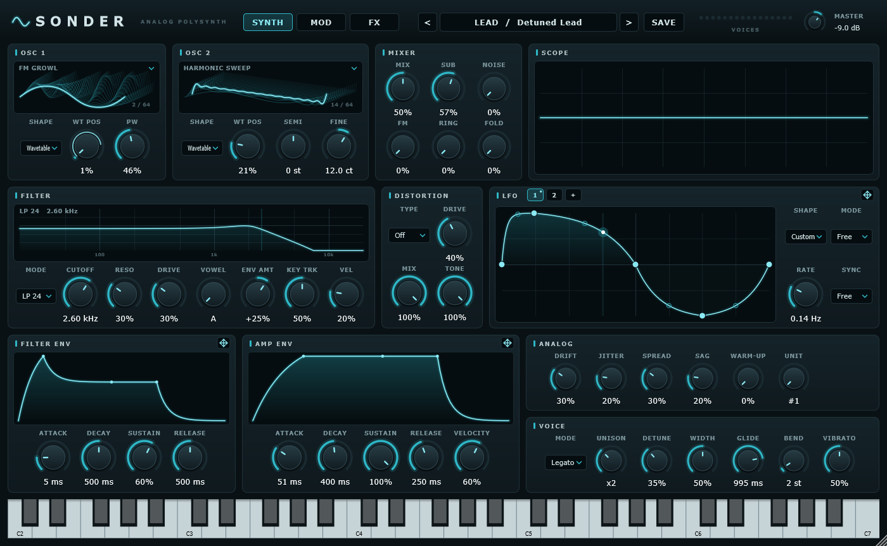

<div align="center">

# 〰 SONDER

**A polyphonic synthesizer with an analog soul and wavetable muscle**

VST3 · Standalone · Windows · C++20 · JUCE 9



</div>

---

A digital synth sounds exactly the same every time you press a key. An analog one never does. Oscillators slowly wander out of tune, parts on the voice cards differ from each other, the power supply sags under a dense chord, and a cold instrument plays flat until it warms up.

**Sonder** models these imperfections and puts them on knobs. It pairs them with modern sound-design tools: wavetable oscillators, a formant filter, drawable LFOs and drag-and-drop modulation.

## Analog character

| Knob | What it does |
|---|---|
| **Drift** | Slow random wander of pitch and filter cutoff. Each oscillator drifts on its own, so the beating between them keeps changing |
| **Jitter** | Fast pitch instability that takes the sterile edge off the sound |
| **Spread** | Component tolerances between voice cards: each voice has its own tuning, cutoff, envelope speed, level and stereo position |
| **Sag** | Power supply sag: loud chords pull the pitch down and slightly compress the level |
| **Warm-up** | Cold start: right after loading, the instrument plays flat and drifts more, then settles within about a minute |
| **Unit** | 16 "hardware units", each with its own fixed set of tolerances, like two synths of the same model |

On top of that, the oscillators are free-running and never reset phase on a new note, the envelopes behave like RC circuits, and voices are assigned round-robin, as on a Juno or a Prophet.

## Sound

**Oscillators**
- Two oscillators: alias-free saw, pulse, triangle and sine (PolyBLEP), or **wavetable**
- Morph through the frames of a table with the **WT Pos** knob. LFOs and envelopes can drive it too
- Built-in tables: Basic Shapes, PWM, Harmonic Sweep, **Vocal**, FM Growl, Sync, Fold
- **Your own wavetables**: Serum-format WAVs (2048-sample frames), single cycles and arbitrary files
- Sub oscillator, noise, FM, ring modulation, wavefolder
- Up to 4 unison layers with detune and stereo width

**Filter**
- Moog-style ladder: LP 24 / LP 12 / Band / High. Resonance goes all the way to self-oscillation, and drive "eats" the resonance just like the original
- **Vowel**: a formant filter for "a-e-i-o-u". The Vowel knob picks the vowel and Cutoff shifts the formants. Made for talking and growling basses

**Distortion** after the filter: Tube, Hard, Fold and Crush, with Drive, Mix and Tone controls

**Effects** on their own page: Juno-60-style chorus, tape ping-pong delay with wow and flutter, reverb

## Modulation

- **8 LFOs**: open more tabs with the "+" button. Free / Retrig / Env modes and host tempo sync
- **Serum-style LFO shape editor**: drag points, double-click to add or remove a point, drag the handle in the middle of a segment to bend it. Hold Shift to snap to the grid; right-click for preset shapes
- **Drag and drop**: grab an LFO tab or the ✥ icon on an envelope and drop it on any highlighted knob. The connection is created for you
- **Modulation rings** on knobs show the modulation range, and a white dot shows the live value
- **Alt+drag** on a knob changes modulation depth; right-click opens the connection menu (invert, remove)
- **Mod matrix** with 32 slots: 15 sources (LFOs, envelopes, velocity, mod wheel, aftertouch, key, random) and 27 destinations, including the LFO rates themselves

## Visuals

- Oscilloscope that locks to the period of the playing note
- Oscillator display: a 3D stack of wavetable frames with the live position highlighted
- Filter frequency response that moves with cutoff and vowel modulation
- Envelope graphs, LFO shape and phase, voice activity LEDs
- Resizable window; on-screen keyboard in the standalone version

## Presets

27 factory presets in the **Bass**, **Lead**, **Pad**, **Keys**, **Pluck** and **FX** categories are built into the plugin, and your DAW sees them as programs. Try **Vocal Growl**, **Talking Lead** and **Glass Table**.

The **SAVE** button stores your own presets in `%APPDATA%\Sonder\Presets` as `.sonderpreset` XML files, together with drawn LFO shapes and wavetable choices. Your wavetables live in `%APPDATA%\Sonder\Wavetables`: load a WAV from the oscillator menu or just drop files into that folder.

## Building

You need Visual Studio 2022 (with the "Desktop development with C++" workload) and Git.

```bat
git clone --recurse-submodules <url> Sonder
cd Sonder
generate.bat
```

`generate.bat` creates `build\Sonder.sln` with CMake (the copy bundled with Visual Studio works too). Open the solution and build. The startup project is `Sonder_Standalone`, which runs without a DAW.

| Format | Path |
|---|---|
| VST3 | `build\Sonder_artefacts\<Config>\VST3\Sonder.vst3` |
| Standalone | `build\Sonder_artefacts\<Config>\Standalone\Sonder.exe` |

To let your DAW find the plugin, copy `Sonder.vst3` to `C:\Program Files\Common Files\VST3`.

## Project layout

```
Source/
├── dsp/          oscillators, wavetables, ladder and formant filters, distortion, envelopes, LFOs
├── synth/        voice, voice manager, modulation routing
├── fx/           chorus and tape delay
├── presets/      factory presets and preset manager
├── ui/           look and feel, knobs, LFO editor, oscillator and filter displays, oscilloscope
├── Parameters    all plugin parameters
└── Plugin*       processor and editor
external/JUCE     JUCE as a git submodule
```

Synthesis runs at twice the sample rate; effects run at the normal rate. LFOs are computed per voice, so their rates can be modulated too. Wavetables are stored with mip levels, so high notes don't alias.

## License

Sonder is built with [JUCE](https://juce.com) and uses it under the [JUCE 9 Starter licence](https://juce.com/legal/juce-9-licence/).

VST is a registered trademark of Steinberg Media Technologies GmbH.

---

<div align="center">

**Sonder is completely free.** No price, no trial, no registration: download it, make music and share it.

</div>
