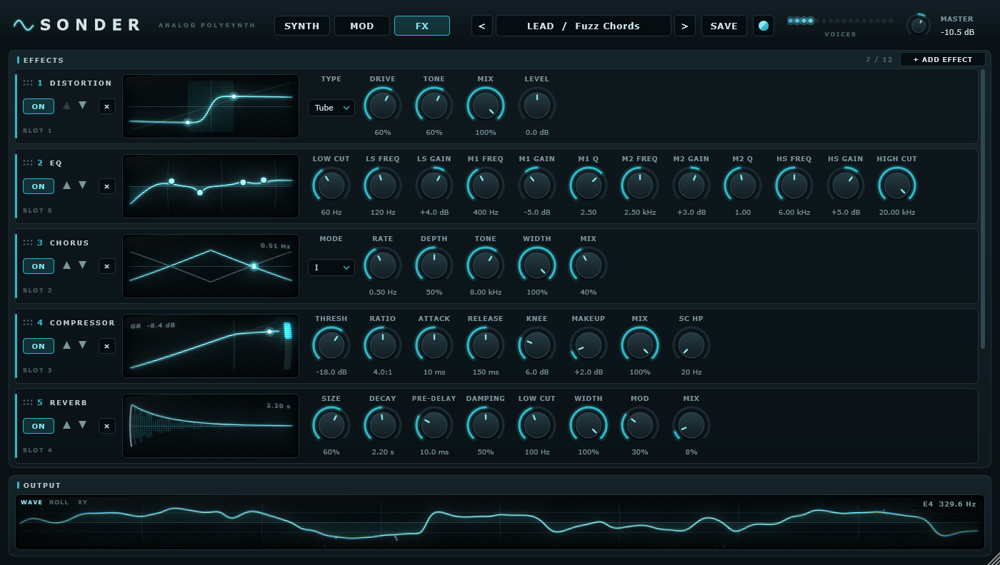
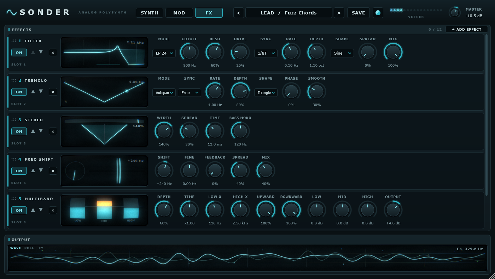
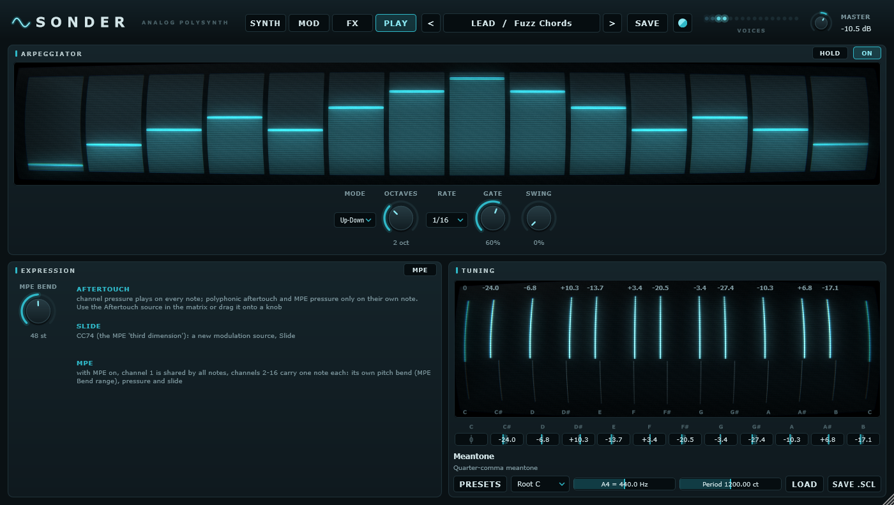
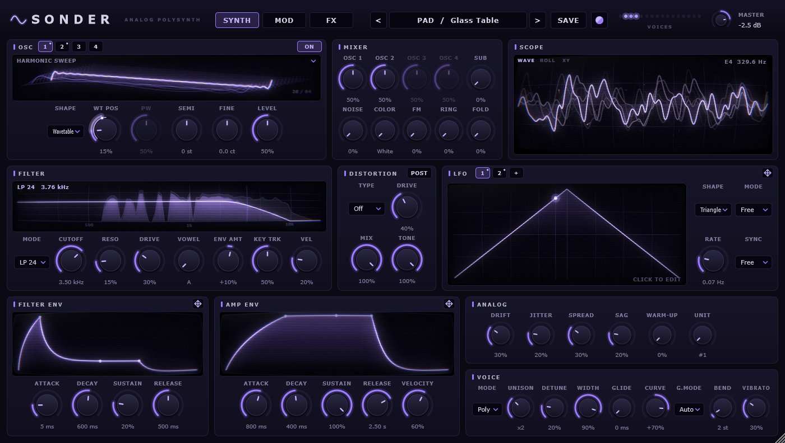

<div align="center">

# 〰 SONDER

**A polyphonic synthesizer with an analog soul and wavetable muscle**

VST3 · Standalone · Windows · C++20 · JUCE 9


</div>

---

A digital synth sounds exactly the same every time you press a key. An analog one never does. Oscillators slowly wander out of tune, parts on the voice cards differ from each other, the power supply sags under a dense chord, and a cold instrument plays flat until it warms up.

**Sonder** models these imperfections and puts them on knobs. It pairs them with modern sound-design tools: wavetable oscillators, a formant filter, drawable LFOs and drag-and-drop modulation.

## Analog character

| Knob | What it does |
|---|---|
| **Drift** | Slow random wander of pitch and filter cutoff. Each oscillator drifts on its own, so the beating between them keeps changing |
| **Jitter** | Fast pitch instability that takes the sterile edge off the sound. Set Drift and Jitter to zero for a perfectly clean digital sound |
| **Spread** | Component tolerances between voice cards: each voice has its own tuning, cutoff, envelope speed, level and stereo position |
| **Sag** | Power supply sag: loud chords pull the pitch down and slightly compress the level |
| **Warm-up** | Cold start: right after loading, the instrument plays flat and drifts more, then settles within about a minute |
| **Unit** | 16 "hardware units", each with its own fixed set of tolerances, like two synths of the same model |

On top of that, the oscillators are free-running and never reset phase on a new note, the envelopes behave like RC circuits, and voices are assigned round-robin, as on a Juno or a Prophet.

## Sound

**Oscillators**
- Four oscillator slots, each with its own on switch, level, tuning and pulse width; two are on by default, switch on more when you need them. Saw, pulse, triangle and sine read from band-limited tables (aliasing below -77 dB up to the top octave), or **wavetable**
- Morph through the frames of a table with the **WT Pos** knob. LFOs and envelopes can drive it too
- 15 built-in tables: Basic Shapes, PWM, Harmonic Sweep, **Vocal**, FM Growl, Sync, Fold, Analog, Organ, Digital, Resonant, Metallic, Formant Sweep, Spectral Noise, Crush
- **Your own wavetables**: Serum-format WAVs (2048-sample frames), single cycles and arbitrary files
- **Hard sync**: oscillators 2-4 can restart their cycle with oscillator 1 (SYNC next to ON), with the reset smoothed by PolyBLEP
- Sub oscillator, through-zero FM, ring modulation, wavefolder
- Noise in six colours: White, Pink, Brown, vinyl Crackle, tape Hiss and pitch-tracked Digital. The **Color** knob morphs smoothly between neighbours, and an LFO or envelope can sweep it
- Up to 4 unison layers with detune and stereo width
- **Glide** with a curve from slow start through linear to fast start, and a mode: on every note, only between overlapping notes, or Auto (overlapping only in Legato voice mode)
- **Sound quality** per instance (view menu next to SAVE): Eco runs the voices at the host rate for about half the CPU, Normal at 2x, High at 4x. Offline renders switch to High automatically. Saved with the project, not with presets; the latency reported to the host is the same in every mode

**Filters**
- Two filters, in series or in parallel. The second one is off until you need it
- Moog-style ladder with Xpander-style modes: LP 24, LP 12, HP 24, HP 12, BP 24, BP 12 and Notch. Resonance goes all the way to self-oscillation, and drive "eats" the resonance just like the original
- **Vowel**: a formant filter for "a-e-i-o-u". The Vowel knob picks the vowel and Cutoff shifts the formants. Made for talking and growling basses

**Distortion** per voice, before or after the filter (PRE / POST): Tube, Hard, Fold and Crush, with Drive, Mix and Tone controls. **Tube** is a model of a two-stage triode preamp: asymmetric clipping with even harmonics, bias that shifts with the playing, bass tightened before the gain and highs tamed after it, so even full drive stays smooth instead of fizzy

**Effects rack** on its own page: 12 slots that you fill in any order with **+ ADD EFFECT**. The same effect can be used several times, so two delays or a distortion before and after the reverb are fine. Each effect is a strip with its own display and knobs; drag a strip by the grip (or use the arrows) to move it along the chain, switch it off with **ON**, remove it with **×**.

- **Distortion** of the whole mix: Tube, Hard, Fold, Crush, with Drive, Tone, Mix and Level
- **Phaser**: 4 to 12 stages, centre frequency, feedback, stereo spread
- **Flanger**: positive and negative feedback, base delay, stereo spread
- **Chorus**: the two Juno-60 modes, both together, or Free with your own rate and depth
- **Delay**: tempo sync or free time, tape wow and flutter, low and high cut for the repeats, ping-pong width and right-channel offset
- **Compressor**: soft knee, parallel mix and a sidechain high-pass so the bass doesn't pump
- **Reverb**: size, decay time up to 20 s, pre-delay, damping, low cut, width and tail modulation
- **EQ**: low and high cut, two shelves and two parametric bands. Drag the points right on the curve; the mouse wheel changes Q
- **Filter**: the same ladder filter with its own LFO on the cutoff, tempo sync and stereo offset
- **Tremolo**: tremolo or autopan, five shapes, tempo sync, stereo phase and smoothing of hard edges
- **Stereo**: width from mono to 200%, widening of mono sounds that stays mono-compatible, and bass kept in the centre
- **Limiter**: look-ahead brickwall with gain, ceiling and release
- **Multiband**: three-band upward and downward compression in the spirit of OTT
- **Freq Shift**: shifts every frequency by the same number of hertz, with feedback and opposite shift in the right channel

Every knob of every slot is visible to the host for automation, under the slot number and the name of the effect in it.





## Modulation

- **8 LFOs**: open more tabs with the "+" button. Free / Retrig / Env modes and host tempo sync
- **Serum-style LFO shape editor**: drag points, double-click to add or remove a point, drag the handle in the middle of a segment to bend it. Hold Shift to snap to the grid; right-click for preset shapes
- **Drag and drop**: grab an LFO tab or the ✥ icon on an envelope and drop it on any highlighted knob. The connection is created for you. Hover over a page button while dragging to reach knobs on another page; the FX page also has its own row of sources above the rack
- **Modulated LFO points**, as in Serum: drop a source onto a point of a custom LFO shape to move its height (with Alt - its time). The editor shows the range and the live shape
- **Modulation rings** on knobs show the modulation range, and a white dot shows the live value
- **Alt+drag** on a knob changes modulation depth; right-click opens the connection menu (direction, invert, remove)
- **Direction** of every connection: both ways from the knob (how an LFO swings by default), up only or down only. An LFO set to Up only adds to the knob, Down only takes away
- **Every continuous knob** can be modulated: envelope times, filter Env Amt / Key Track / Velocity, glide, unison, vibrato, the analog knobs, oscillator Fine, Ring, distortion Tone, **Master** and **every knob in the effects rack**. Knobs added later in the list move by a share of their travel: 100% is the whole scale
- The rack and Master are shared by all notes: they follow the modulation sources of the last played note, and a Free LFO keeps moving them even when nothing is playing
- **Mod matrix** with 32 slots: 16 sources (LFOs, envelopes, velocity, mod wheel, aftertouch, slide, key, random) and every destination above; rack knobs are listed by the effect in their slot

## Playing

- **Arpeggiator**: Up, Down, Up-Down, Random and As Played, 1 to 4 octaves, rate from 1/4 to 1/32 with triplets and dotted notes, gate, swing and Hold. With the host transport playing the steps follow its grid, otherwise the pattern starts with the first key
- **MPE**: every note on its own channel with its own pitch bend (range up to 96 semitones), pressure and slide (CC74). Channel 1 stays global
- **Polyphonic aftertouch** reaches only its own note; the new **Slide** source is CC74
- **Microtuning**: drag the notes of the scale on the screen or type their offsets in cents, pick a ready tuning (just intonation, Pythagorean, meantone, Werckmeister III, Kirnberger III, quarter tones, 19-TET, Bohlen-Pierce), set the root key, A4 (concert pitch) and a stretched octave. Load Scala (.scl) or AnaMark (.tun) files, save your scale as .scl. The tuning is saved with the project



## Visuals

- Oscilloscope with three modes: **WAVE** locks to the period of the playing note, **ROLL** scrolls the waveform over 50 ms to 2 s so you can see attacks, envelopes and LFOs, **XY** is a stereo vectorscope
- The trace leaves a phosphor afterglow, and its colour follows the sound: a dark bass glows deep blue, a bright lead turns pale turquoise, louder means more glow. Loud notes throw sparks off the waveform
- **GPU shaders** on the screens: bloom around bright lines, a curved CRT glass with scanlines, colour fringes at the edges and grain. They run in a hidden OpenGL context, so the plugin window itself draws as usual; without a suitable GPU the screens fall back to the software look
- Oscillator display: a 3D stack of wavetable frames that sways slowly and tilts after the mouse; the live position leaves a trail when it is modulated
- Filter frequency response of both filters that moves with cutoff and vowel modulation, drawn over the live spectrum before and after the filter, so you see what the filter removes
- Knobs breathe with their modulation and glide to the new values when you change presets
- Voice LEDs follow each voice's envelope and take their colour from the pitch
- A cold instrument (Warm-up) looks dimmer and brightens as it settles; power sag dims the screens
- Four themes and nine accent colours in the menu next to SAVE; every effect above can be switched off there. If the host's interface feels sluggish with the window open, switch off the shaders and CRT screens first



- A display for every effect: the distortion curve, moving notches of the phaser and flanger, delay repeats on a timeline, the compressor curve with a live gain-reduction meter, the reverb tail, the editable EQ curve, the swept filter, the tremolo shape, stereo width with a correlation meter, limiter and multiband meters and the frequency shift
- Envelope graphs, LFO shape and phase
- Resizable window; on-screen keyboard in the standalone version

## Presets

35 factory presets in the **Bass**, **Lead**, **Pad**, **Keys**, **Pluck** and **FX** categories are built into the plugin, and your DAW sees them as programs. Try **Vocal Growl**, **Talking Lead**, **Glass Table**, **Tonewheel** and **Dark Room**.

The **SAVE** button stores your own presets in `%APPDATA%\Sonder\Presets` as `.sonderpreset` XML files, together with drawn LFO shapes, wavetable choices and the effects rack. Your wavetables live in `%APPDATA%\Sonder\Wavetables`: load a WAV from the oscillator menu or just drop files into that folder.

## Building

You need Visual Studio 2022 (with the "Desktop development with C++" workload) and Git.

```bat
git clone --recurse-submodules <url> Sonder
cd Sonder
generate.bat
```

`generate.bat` creates `build\Sonder.sln` with CMake (the copy bundled with Visual Studio works too). Open the solution and build. The startup project is `Sonder_Standalone`, which runs without a DAW.

| Format | Path |
|---|---|
| VST3 | `build\Sonder_artefacts\<Config>\VST3\Sonder.vst3` |
| Standalone | `build\Sonder_artefacts\<Config>\Standalone\Sonder.exe` |

To let your DAW find the plugin, copy `Sonder.vst3` to `C:\Program Files\Common Files\VST3`.

## Project layout

```
Source/
├── dsp/          oscillators, wavetables, noise, ladder and formant filters, distortion, envelopes, LFOs
├── synth/        voice, voice manager, modulation routing, arpeggiator, tuning
├── fx/           effects rack: distortion, phaser, flanger, chorus, tape delay, compressor, reverb, EQ,
│                 filter, tremolo, stereo, limiter, multiband, frequency shifter
├── presets/      factory presets and preset manager
├── ui/           look and feel, themes, knobs, LFO editor, oscillator, filter and effect displays, oscilloscope
├── Parameters    all plugin parameters
└── Plugin*       processor and editor
external/JUCE     JUCE as a git submodule
```

Synthesis runs at twice the sample rate; effects run at the normal rate. LFOs are computed per voice, so their rates can be modulated too. Wavetables are stored with mip levels that crossfade into each other, so high notes don't alias and glides don't change brightness in steps.

## License

Sonder is built with [JUCE](https://juce.com) and uses it under the [JUCE 9 Starter licence](https://juce.com/legal/juce-9-licence/).

VST is a registered trademark of Steinberg Media Technologies GmbH.

---

<div align="center">

**Sonder is completely free.** No price, no trial, no registration: download it, make music and share it.

</div>
